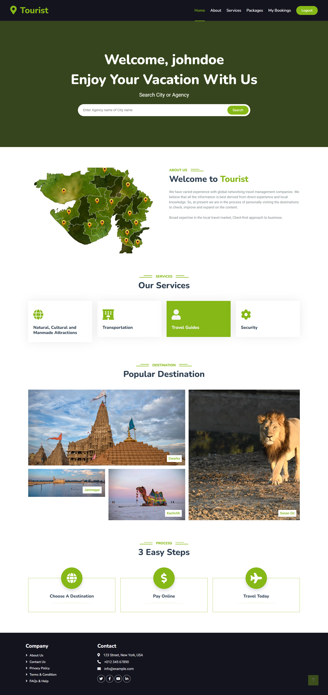
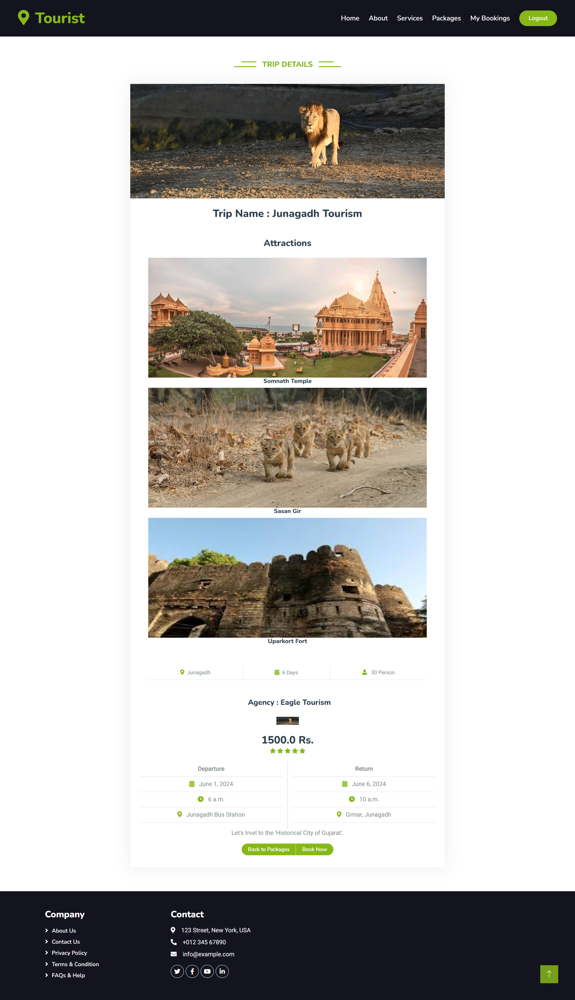
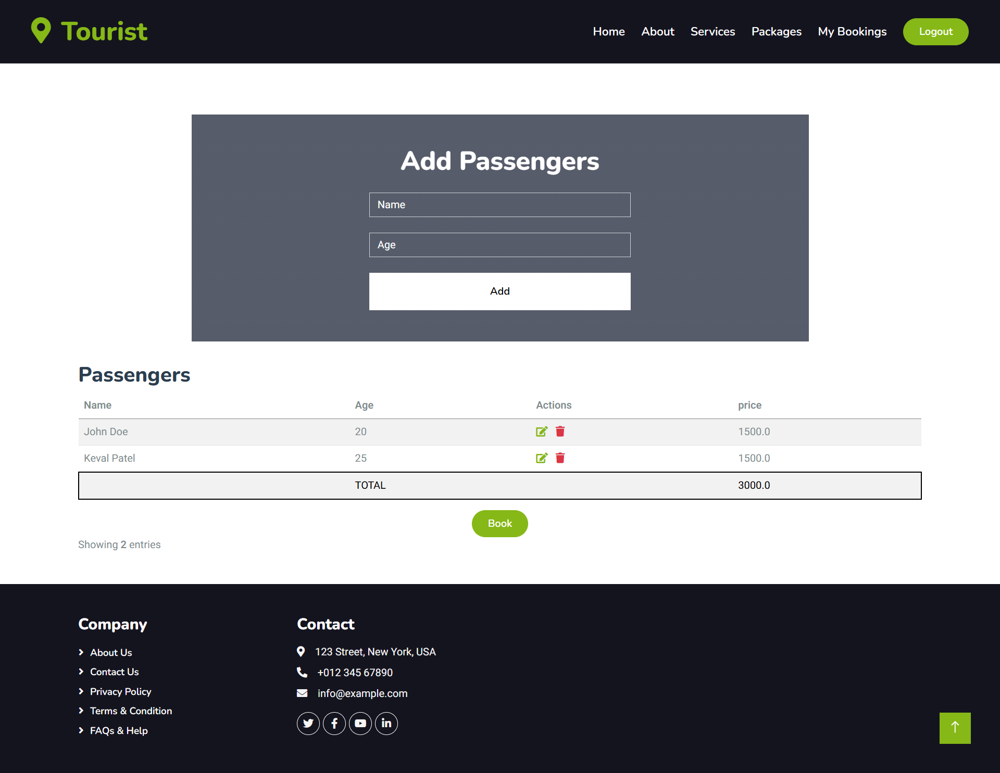
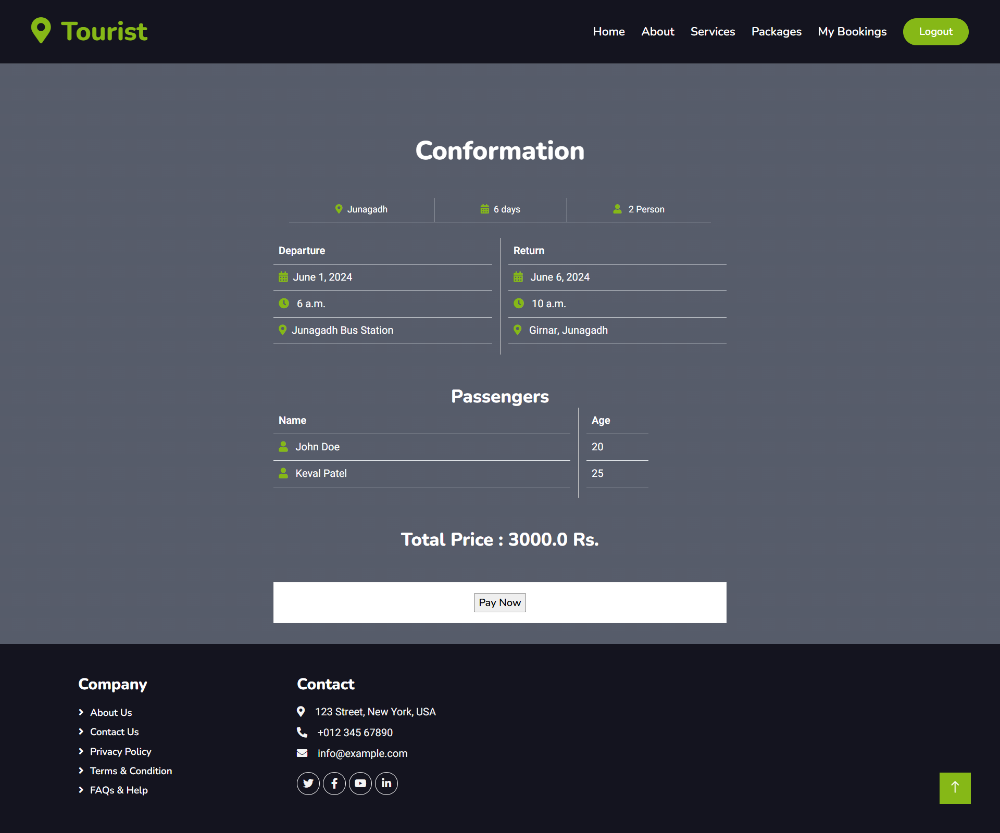
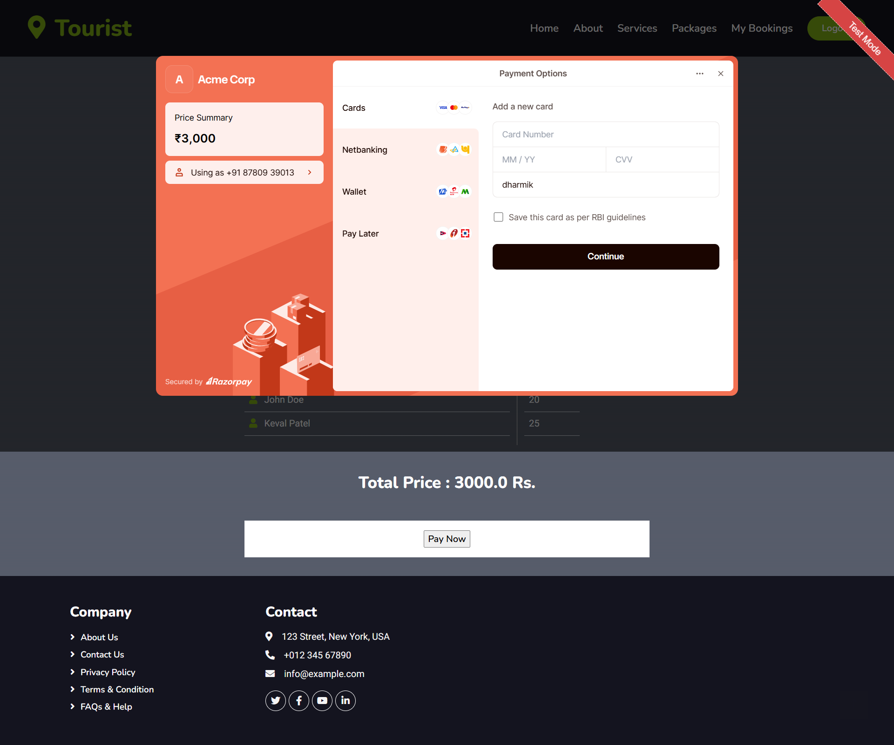
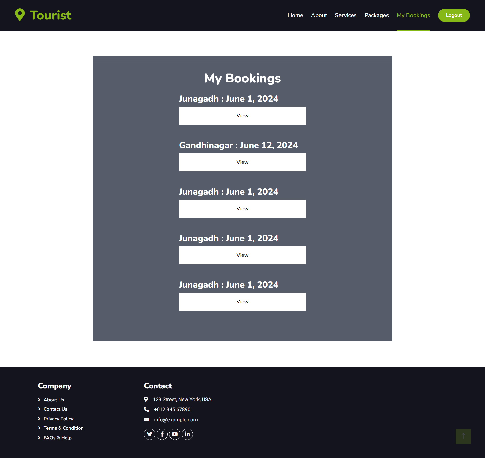
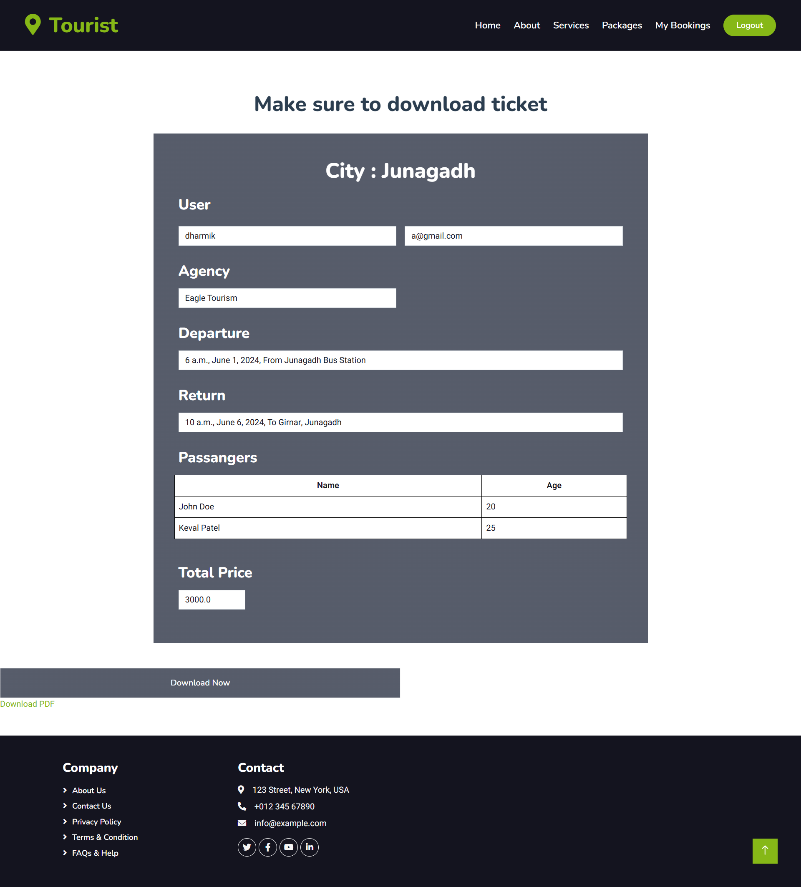

# City Travel Management

A City Travel Management application designed to help users plan city trips efficiently by connecting travelers with agencies. The application provides a seamless experience for location search, booking travel packages, and managing itineraries.

## Home Page

## Agecy Packages

## View Package details

## Add passenger for booking

## Booking Confirmation

## RazorPay Payment

## View Bookings

## View Ticket


## Features

- **Location Search**: Discover and explore destinations and points of interest.
- **User Authentication**: Separate login for travelers and agencies, ensuring personalized experiences.
- **Agency Access**: Agencies can manage travel packages and featured locations.
- **Travel Package Booking**: Travelers can book tickets and explore curated travel packages.

## Installation

To set up this project locally, follow these steps:

### Prerequisites

- Python 3.x
- Git

### Installation steps

1. **Clone the Repository**
    ```bash
    git clone https://github.com/Dharmik090/city-travel-management.git
    cd city-travel-management
    ```

2. **Install required packages**<br>
Install Dependencies Navigate to the project directory and install the required Python packages:
    ```bash
    pip install -r requirements.txt
    ```

3. **Create local database**<br>
Execute city_travel_management.sql in MySQL

4. **Run Application**<br>
Run the Application Start the application by running:
    ```bash
    python manage.py runserver
    ```

    Access the Application Open your web browser and go to:
    http://127.0.0.1:8000/